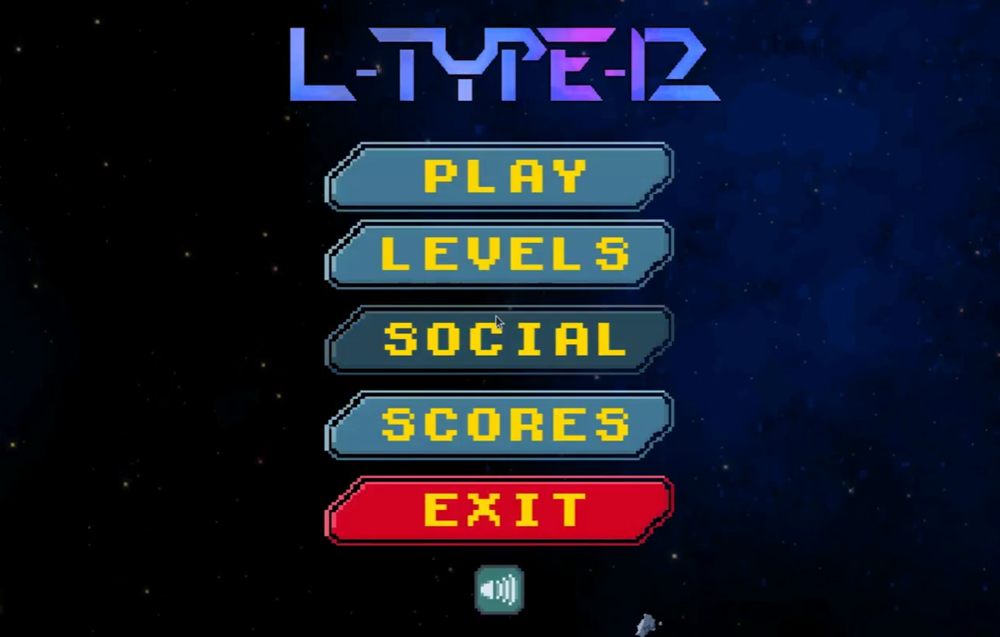

#  L-type group 12 - 2020-2021

## Grade : 17.5/20

## Authors

| GitHub ids | Nom & Prénom |
|------------|--------------|
|  adiscepo  | Discepoli Attilio |
|  stektas   | Tektas Samed |
|  timarque  |  Marques Tiago |
|  iddiallo  | Diallo Idiatou |
|  aledegro  | De Groodt Alexandre |
|  EdgardoCuellar | Cuellar Sanchez Edgardo |
|  maluyckx  | Luyckx Marco |
|  vpiryns   | Piryns Victor |
|  dibenite  | Benitez Alberdi Diego |

## Description

L-Type is a multiplayer vertical scrolling shoot 'em up game in which one or two players must navigate through multiple levels, destroying enemies that appear in front of them and dodging the bullet barrages unleashed by these enemies. The warships controlled by the players can collect weapon bonuses dropped by their numerous adversaries. These bonuses allow the players to improve their weapons and thus increase their chances of survival. The game ends when the players have lost all their lives. 

## Game modes
A game can be played by one or two players, but the number of players must be set at the start of the game (i.e., Player 2 cannot join a game in progress). The gameplay remains the same in both cases.

The difficulty level of a game determines the resistance of the enemy ships.

## Game Creation

When a player creates a game, they must configure (at least) the following parameters :

- Number of players.
- Game difficulty.
- Probability of a bonus appearing when an enemy ship is destroyed.
- Friendly fire (existence of friendly fire).
- Number of lives for each player.

## Game Features

Every player should be able to :

- Create an account associated with a nickname and password.
- Log in to their account.
- Manage a friends list.
- Configure and create a game.
- Automatically join an already created game.
- Invite one or more friends to their created game.
- View a leaderboard of existing players based on one or multiple chosen metrics.

